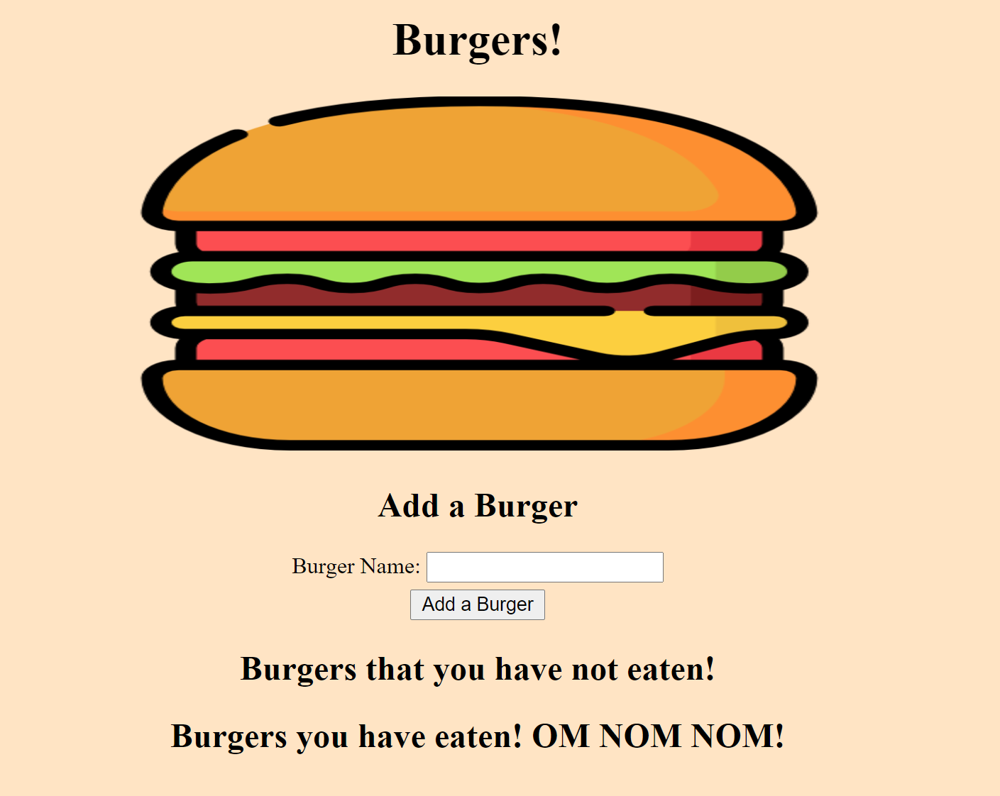

  
# Eat-Dah-Burger

## Description 
The purpose of this project is to track burgers that you have eaten or want to eat in the future and store it in a SQL database. 

## Project Demonstration
  

## Table of contents

- [Description](#description)
- [Installation](#installation)
- [Usage](#usage)
- [License](#license)
- [Contributing](#contributing)
- [Questions](#questions)
- [Repository Link](#repository)

## Installation

        Step 1: Download the github repo. Step 2: Run NPM Install. Step 3: Run NPM install mySQL

## Usage

        Step 1: Type in the name of the burger you want to add. Step 2: Click the Om Nom button to move the burger to eaten status. 

## License
MIT 

## Contributing

The owner of this project is KJ-Labs, you're welcome to contribute.

## Questions

- If you have any questions, please contact me on Github.
- undefined
- [KJ-Labs](https://github.com/KJ-Labs)

## Repository

- [Project Repo](https://github.com/KJ-Labs/Eat-DA-BURGAH)

## Screenshots
  

